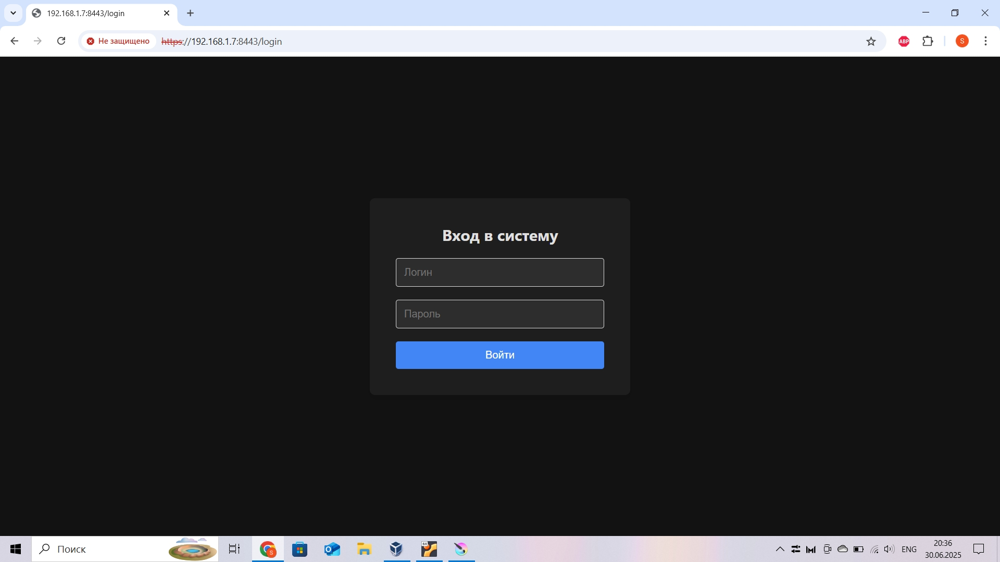
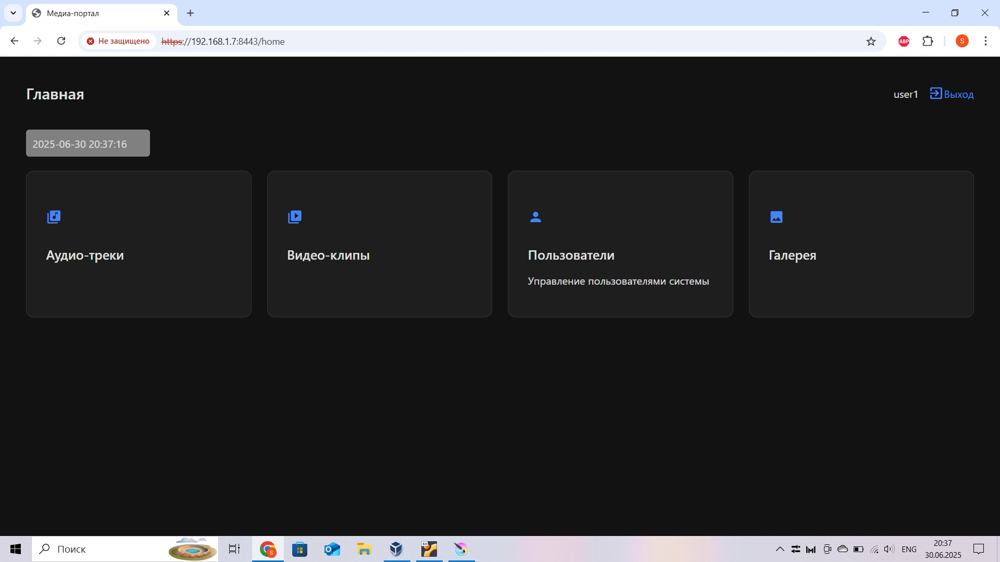
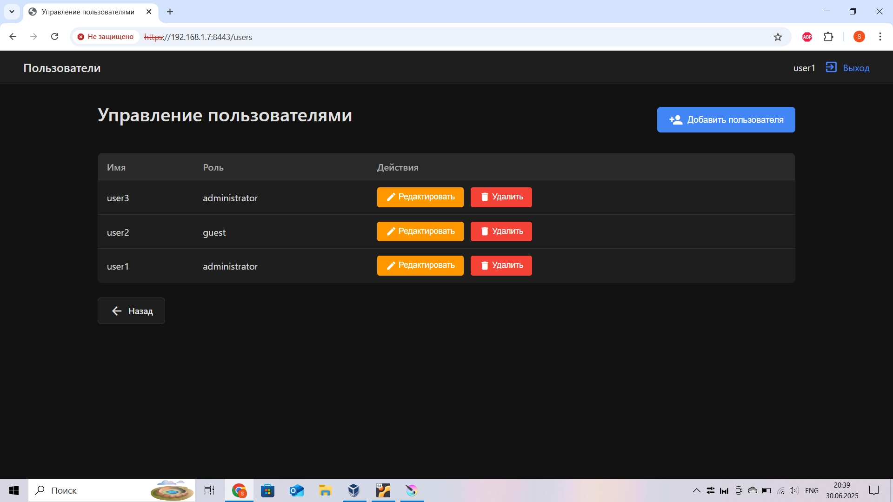
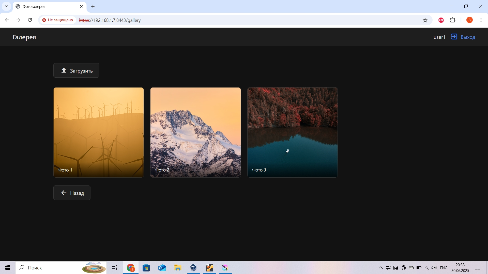

# Crow Server Test Project

Тестовая площадка (отправная точка) для разработки веб-сервера на Crow (C++).
-----------------------------------------------------------------------------

Работу данного сервера возможно настроить под Linux и Windows (вероятно под MakOS тоже - не тестировал).
Данный проект тестировался на Linux Mint и на AntiX Linux (на сильно устаревшем ПК).
Для корректной работы понадобятся библиотеки boost, openssl, asio, crow, sqlite3 (присутствует в данном проекте).

Для Linux:
boost, openssl, asio - можно поставить с официальных репозиториев операционной системы.
сrow - необходимо собрать из исходников (документация на официальном сайте).

Для Windows:
Самый удобный способ установить boost, openssl, asio, crow при помощи VCPKG (документация есть на соответствующих сайтах этих библиотек).
При необходимости можно собрать каждую библиотеку вручную.

-----------------------------------------------------------------------------
ОСОБЕННОСТИ ДАННОГО ПРОЕКТА.
Полный ручной контроль:
1) Управление базами данных (в данном примере используется sqlite3)
2) Управление шифрованием и аутентификацией (необходимы ключи/сертификаты для корректной работы HTTPS, проект тестировался с самоподписанными ключами)
3) Управление шифрованием паролей (в коде используется хэширование предоставляемое одной из функций библиотеки OpenSSL)
4) Управление логгированием сервера (по умолчанию логи сохраняются в корневую build-папку проекта)
5) Управление сессиями проекта (Cookies, токены, проверка паролей, блокировка пользователей, попытки ввода пароля) 
6) Управление обновлением динамической информации (в проекте есть пример обновления WEB-сокета, производящееся с сервера в отдельном потоке)

Высокая скорость работы, благодаря реализации на языке C++

В базе данных имеются 3 пользователя:
1) login: user1; password: 1; role: administrator
2) login: user2; password: 2; role: guest
3) login: user3; password: 3; role: administrator

При сборке проекта следует создать корректную структуру папок:
В build-папке проекта должны быть папки templates, static (с папкой images), songs, videos и файл users.db

-----------------------------------------------------------------------------

## Структура проекта
- `src/` - Исходный код сервера (QtCreator проект)
- `content/` - HTML/CSS/JS файлы фронтенда, база данных содержащая пользователей (по умолчанию, содержимое данной папки следует скопировать в build-проекта)
- `screenshots/` - Скриншоты интерфейса

## Примеры

